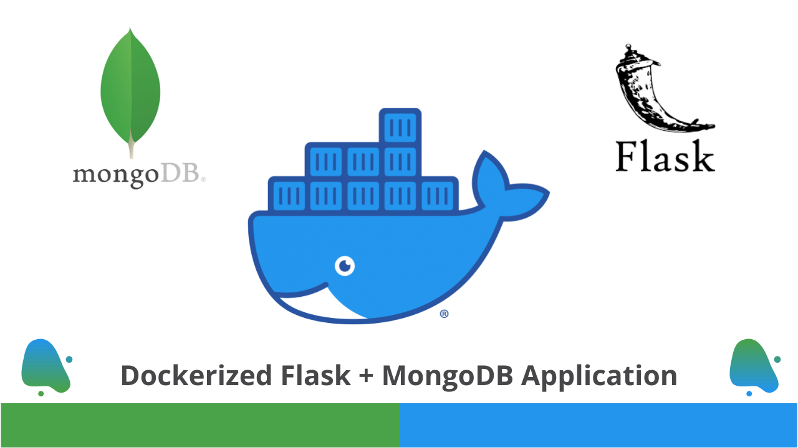
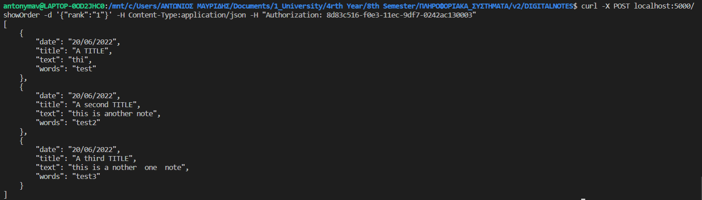
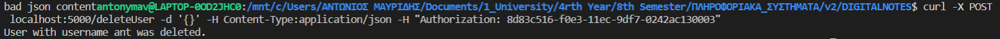
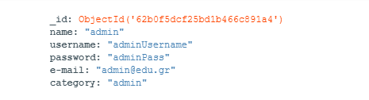
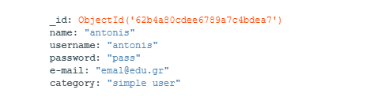
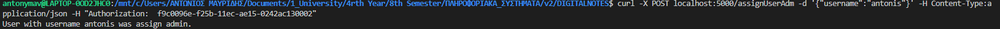
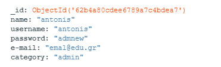
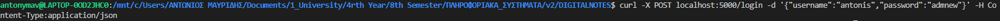
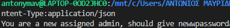
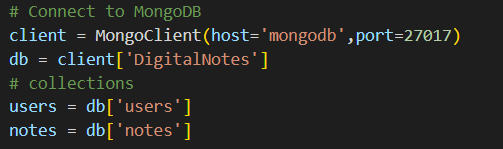

# YpoxreotikiErgasia22_E18102_MAVRIDIS_ANTONIOS
A Python application in Docker with Mongodb Database that simulates the GoogleKeep application.

 </br>

# Digital Notes  </br>

## Περιγραφή της Εφαρμογής
Σκοπός της εφαρμογής αποτελεί η υλοποίηση μιας υπηρεσίας Digital Notes,
δηλαδή μιας υπηρεσίας καταγραφής σημειώσεων, αντίστοιχη του Google Keep ή του Simplenote.

## Web Service: Λειτουργίες Απλού Χρήστη

### Entrypoint: /createSimpleUser
Με το συγκεκριμένο entrypoint γίνεται η εγγραφή ενός χρήστη στο σύστημα με το ονοματεπώνυμό του, το email του, το username του και ένα password. Γίνεται αναζήτηση του email που έδωσε ο χρήστης αν υπάρχει ήδη στη βάση, ως εγγρεγραμμένος και επίσης ελέγχεται και το username εάν κατέχεται από άλλον χρήστη, ώστε να ειδοποιηθεί με κατάλληλο μήνυμα. <p>
Η παραπάνω διαδιακασία πραγματοποιείται με την:
```
@app.route('/createSimpleUser', methods=['POST'])
```
Για την εισαγωγή δεδομένων στη βάση χρησιμοποιούμε την εξής εντολή:
```
curl -X POST localhost:5000/createSimpleUser 
-d '{"name":"antonis","username":"ant","password":"pass","e-mail":"emal@edu.gr"}'  -H Content-Type:application/json
```
Έπειτα από την επιτυχής προσθήκη του νέου χρήστη, o χρήστης ενημερώνεται με το εξής επιτυχίας:
 ```
User ant was added.
```
Παρακάτω παρουσιάζεται παράδειγμα εκτέλεσης επιτυγχούς εγγραφής ενός χρήστη:
 </br>

### Entrypoint: /login
Στην συνέχεια ο χρήστης θα χρειαστεί να κάνει login έτσι ώστε να έχει πρόσβαση στις υπόλοιπες λειτουργίες του συστήματος. <p>
Η παραπάνω διαδικασία πραγματοποιείται με την:
```
@app.route('/login', methods=['POST'])
``` 
Συγκεκριμένα, ο χρήστης δίνει το username του και το password που όρισε κατά την εγγραφή του. Πραγματοποιέιται αναζήτηση στη βάση ως εξής:
``` 
users.find_one({"username":data["username"], "password":data["password"]})
``` 
Aν α στοιχεία είναι έγκυρα και βρεθεί ο χρήστης , τότε καλείται η συνάρτηση create_session() με παράμετρο το username του χρήστη και θα γίνεται επιτυχής είσοδος στην υπηρεσία. Διαφορετικά, θα εμφανίζεται ανάλογο μήνυμα που θα προτρέπει το χρήστη να εισάγει τα στοιχεία του και πάλι. Μόνο στη περίπτωση που ένας χρήστης έχει κάνει
επιτυχημένα την είσοδό του στο σύστημα θα μπορεί να εκτελέσει τις υπόλοιπες λειτουργίες της εφαρμογής. <p>

Για την εισαγωγή δεδομένων στη βάση και την πραγματοποίηση του login χρησιμοποιούμε την εξής εντολή:
```
curl -X POST localhost:5000/login -d '{"username":"ant","password":"pass"}' -H Content-Type:application/json
```
 </br>

Ως αποτέλεσμα έχουμε την δημιουργία του κατάλληλου AUTHORIZATION_ID το οποίο χρησιμοποιείται εκτενώς για τις υπόλοιπες διεργασίες. Αν πρόκειται για διαχειριστή του συστήματος δημιουργείται και ADMIN_AUTHORIZATION_ID.
 ```
Userid for user ant : 8d83c516-f0e3-11ec-9df7-0242ac130003
```
Για όλα τα παρακάτω endpoints απαιτείται η σύνδεση του χρήστη στο σύστημα. Για κάθε curl, εντολή εκτέλεσης, ο χρήστης δίνει τον κωδικό αυθεντικοποίησης του στο header. Ο κωδικός ελέγχεται με τη συνάρτηση is_session_valid() και αν δεν είναι έγκυρος επιστρέφεται κατάλληλο μήνυμα με status 401.

Παρακάτω παρουσιάζεται η περίπτωση μη έγκυρης αυθεντικοποίησης:
 </br>

### Entrypoint: /createNote
Μέσω αυτού του entrypoint ο χρήστης μπορεί να δημιουργήσει μια νέα σημείωση η οποία θα αποτελείται από έναν τίτλο, το κείμενο αναφοράς και λέξεις κλειδία. Η παραπάνω διαδιακασία πραγματοποιείται με την:
```
@app.route('/createNote', methods=['POST'])
``` 
 Οι παραπάνω πληροφορίες εισάγονται από το χρήστη, ενώ αποθηκεύεται αυτόματα και η ημερομηνία δημιουργίας για την εκάστοτε σημείωση ως εξής:
```
d1 = today.strftime("%d/%m/%Y")
data['date']=d1
 ```
Για την ειασωγή μιας σημειώσης στο σύστημα χρησιμοποιούμε την εξής εντολή:
 ```
curl -X POST localhost:5000/createNote 
-d '{"title":"A TITLE_test","text":"thi","words":"test"}' 
-H Content-Type:application/json -H "Authorization: 8d83c516-f0e3-11ec-9df7-0242ac130003"
 ```
Έπειτα από την επιτυχή εισαγωγή της σημείωσης εμφανίζεται το εξής μήνυμα στον χρήστη:
 ```
NOTE A TITLE was added to database.
```
Παρακάτω παρουσιάζεται η περίπτωση επιτυγχής δημιουργίας του πρώτου σημειώματος:
 </br>

Αντίστοιχα για λόγου χάρη του παραδείγματος θα προσθέσουμε άλλες δύο σημειώσεις ως εξής:
```
curl -X POST localhost:5000/createNote 
-d '{"title":"A second TITLE","text":"this is another note","words":"test2"}'  
-H Content-Type:application/json -H "Authorization: 8d83c516-f0e3-11ec-9df7-0242ac130003"
```
```
NOTE A second TITLE was added to database.
```
Παρακάτω παρουσιάζεται η περίπτωση επιτυγχής δημιουργίας του δεύτερου σημειώματος:
 </br>
```

curl -X POST localhost:5000/createNote 
-d '{"title":"A third TITLE","text":"this is a nother  one  note","words":"test3"}' 
-H Content-Type:application/json -H "Authorization: 8d83c516-f0e3-11ec-9df7-0242ac130003"
```

Παρακάτω παρουσιάζεται η περίπτωση επιτυγχής δημιουργίας του τρίτου σημειώματος:
 </br>

```
NOTE A third TITLE was added to database.
```
### Entrypoint: /searchNote
Μέσω αυτού του entrypoint ο χρήστης μπορεί να αναζητά μια σημείωση με βάση τον τίτλο της. Η παραπάνω διαδιακασία πραγματοποιείται με την:
```
@app.route('/searchNote', methods=['POST'])
``` 
Η αναζήτηση της σημείωσης μπορεί να πραγματοποιηθεί ως εξής:
``` 
curl -X POST localhost:5000/searchNote -d '{"title":"A TITLE"}'
-H Content-Type:application/json -H "Authorization: 8d83c516-f0e3-11ec-9df7-0242ac130003"
``` 
Στην περίπτωση που υπάρχει η σημειώση, επιστρέφονται τα δεδομένα της στον χρήστη. Στην συγκεκριμένη περίπτωση επιστρέφεται:
``` 
[
    {
        "title": "A TITLE",
        "text": "this is a note",
        "words": "test"
    }
]
``` 
Παρακάτω παρουσιάζεται η περίπτωση επιτυχής αναζήτησης σημειώματος μέσω του τίτλου:
 </br>

Τα αποτελέσματα που μπορούν να επιστραφούν στον χρήστη μπορεί να είναι από ένα ή και περισσότερα ή και κανένα. 
 
 

### Entrypoint: /searchWord
Μέσω αυτού του enrtypoint ο χρήστης μπορεί να αναζητά μια σημείωση με βάση λέξης κλειδίου. Η παραπάνω διαδιακασία πραγματοποιείται με την:
```
@app.route('/searchWord', methods=['POST'])
``` 
Η αναζήτηση της σημείωσης μπορεί να πραγματοποιηθεί ως εξής:
``` 
curl -X POST localhost:5000/searchWord -d '{"words":"test"}' 
-H Content-Type:application/json -H "Authorization: 8d83c516-f0e3-11ec-9df7-0242ac130003"
``` 
Στην περίπτωση που υπάρχει σε κάποια σημείωση η λέξη κλειδί επίστρεφεται στον χρήστη η αντίστοιχη σημείωση. Εάν υπάρχουν παραπάνω από μια σημειώσεις στην βάση τότε επιστρέφονται ανάλογα με την ημερομηνία της δημιουργίας τους. Στην συγκεκριμένη περίπτωση επιστρέφεται:
``` 
[
    {
        "title": "A TITLE",
        "text": "this is a note",
        "words": "test"
    },
    {
        "title": "A second TITLE",
        "text": "this is another note",
        "words": "test2"
    },
    {
        "title": "A third TITLE",
        "text": "this is another  one  note",
        "words": "test3"
    }
]

``` 
Παρακάτω παρουσιάζεται η περίπτωση επιτυχής αναζήτησης σημειώσεων μέσω της λέξης κλειδί:
 </br>

Τα αποτελέσματα που μπορούν να επιστραφούν στον χρήστη μπορεί να είναι από ένα ή και περισσότερα ή και κανένα. 


### Entrypoint: /updateNote
Μέσω αυτού του entrypoint ο χρήστης μπορεί να διορθώνει/ενημερώνει μια σημείωση αλλάζοντας είτε τον τίτλο της είτε το κείμενό της είτε τις λέξεις κλειδία της, εφόσον βρεθεί η σημείωση στην βάση. Η παραπάνω διαδιακασία πραγματοποιείται με την:
``` 
@app.route('/updateNote', methods=['POST'])
``` 
Αρχικά γίνεται αναζήτηση της σημείωσης με βάση τον τίτλο της και σε περίπτωση που υπάρχει δύναται η τροποποποίησή της:
``` 
 note= notes.find_one({'title':data["title"]})
```
Η παρακάτω εντολή πραγματοποιεί αλλαγήτου τίτλου στην δεύτερη σημείωση:
```
curl -X POST localhost:5000/updateNote 
-d '{"title":"A second TITLE","text":"this is another note","words":"test2"}' 
-H Content-Type:application/json -H "Authorization: 8d83c516-f0e3-11ec-9df7-0242ac130003"
```
Έπειτα από επιτυχή ενημέρωση του τίτλου επιστρέφεται στον χρήστη το εξής μήνυμα:
```
UPDATED A second TITLE 
```
Παρακάτω παρουσιάζεται η περίπτωση επιτυχής ενημέρωση σημειώσεων μέσω της λέξης κλειδί:
 </br>


### Entrypoint: /deleteNote
Μέσω αυτού του entrypoint ο χρήστης μπορεί να διορθώνει/ενημερώνει μια σημείωση αλλάζοντας είτε τον τίτλο της είτε το κείμενό της είτε τις λέξεις κλειδία της, εφόσον βρεθεί η σημείωση στην βάση. Η παραπάνω διαδιακασία πραγματοποιείται με την:
``` 
@app.route('/deleteNote', methods=['POST'])
``` 
Αρχικά γίνεται αναζήτηση της σημείωσης με βάση τον τίτλο της και σε περίπτωση που υπάρχει δύναται η διαγραφή της:
``` 
  note = notes.find_one({'title':data["title"],'username':users_sessions[uuid]})
```
Η παρακάτω εντολή πραγματοποιεί αλλαγήτου τίτλου στην δεύτερη σημείωση:
```
curl -X POST localhost:5000/deleteNote -d '{"title":"A TITLE"}' 
-H Content-Type:application/json -H "Authorization: 8d83c516-f0e3-11ec-9df7-0242ac130003"
```
Έπειτα από επιτυχή ενημέρωση του τίτλου επιστρέφεται στον χρήστη το εξής μήνυμα:
```
Note with title A TITLE was deleted.
```
Παρακάτω παρουσιάζεται η περίπτωση επιτυχής διαγραφή σημειώσεων μέσω της λέξης κλειδί:
 </br>

### Entrypoint: /showOrder
Μέσω αυτού του entrypoint ο χρήστης μπορεί να ζητήσει και να του εμφανιστούν οι σημειώσεις του σε χρονολογική σειρά.
Η παραπάνω διαδιακασία πραγματοποιείται με την:
``` 
@app.route('/showOrder', methods=['POST'])
``` 
Ο χρήστης καταχωρεί την τιμή του "rank" και ανάλογα με το rank εμφανίζονται στην αντίστοιχη χρονολογική σειρά και τα δεδομένα. Αν το rank = 1 τότε εμφανίζονται πρώτα οι παλίοτερες σημειώσεις διαφορετικά αν το rank = -1 τότε εμφανίζονται πρώτα οι τελευταίες σημειώσεις. 
``` 
inta=int(data['rank'])
notesList = notes.find({}).sort('date',inta)
```
Η παρακάτω εντολή πραγματοποιεί την εμφάνισει τον σημειώσεων σε χρονολογική σειρά, εμφανίζοντας πρώτα τις παλαιότερες σημειώσεις:
```
curl -X POST localhost:5000/showOrder -d '{"rank":"1"}' 
-H Content-Type:application/json -H "Authorization: 8d83c516-f0e3-11ec-9df7-0242ac130003"
```
Έπειτα από επιτυχή καταχώρηση του αιτήματος επιστρέφονται στον χρήστη οι σημειώσεις σε χρονολογική σειρά:
```
[
    {
        "date": "19/06/2022",
        "title": "A TITLE",
        "text": "this is a note",
        "words": "test"
    },
    {
        "date": "19/06/2022",
        "title": "A second TITLE",
        "text": "this is another note",
        "words": "test2"
    },
    {
        "date": "19/06/2022",
        "title": "A third TITLE",
        "text": "this is another  one  note",
        "words": "test3"
    }
]

```
Παρακάτω παρουσιάζεται η εμφάνιση των σημειώσεων σε χρονολογική σειρά εμφανίζοντας πρώτα τις παλαιότερες σημειώσεις:
 </br>

### Entrypoint: /deleteUser
Μέσω αυτού του entrypoint ο χρήστης έχει την δυνατότητα να διαγράψει τον λογαριασμό του. Μετά τη διαγραφή του λογαριασμού του, ο χρήστης δεν θα μπορεί πλέον να έχει πρόσβαση στην υπηρεσία και τα στοιχεία του καθώς και οι σημειώσεις που δημιούργησε, θα διαγράφονται. Η παραπάνω διαδιακασία πραγματοποιείται με την:
``` 
@app.route('/deleteUser', methods=['POST'])
``` 
Η παρακάτω εντολή πραγματοποιεί την διαγραφή του χρήστη:
```
curl -X POST localhost:5000/deleteUser 
-d '{}' -H Content-Type:application/json -H "Authorization: 8d83c516-f0e3-11ec-9df7-0242ac130003"
```
Έπειτα από επιτυχή καταχώρηση του αιτήματος διαγράφεται ο λογαριασμός του χρήστη:
```
User with usename ant was deleted
```
Αξίζει να σημειωθεί ότι ο χρήστης δεν χρειάζεται να εισάγει το username αρκεί το Authorization ID.

Παρακάτω παρουσιάζεται η διαγραφή ενός χρήστη:
 </br>


## Web Service: Λειτουργίες Διαχειριστή (Admin User)

### Entrypoint: /assignUserAdm
Μέσω αυτού του entrypoint ο διαχειριστής του συστήματος έχει την δυνατότητα να εισάγει έναν νέο διαχειριστή στο σύστημα, απαραίτητη είναι η εισαγωγή του ονόματός του, του email του, καθώς και ένας κωδικός μίας χρήσης. Ο νέος χρήστης αυτός, όταν θα κάνει είσοδο για πρώτη φορά στο σύστημα, θα ζητείται αυτόματα και η αλλαγή του κωδικού
του. Η παραπάνω διαδιακασία πραγματοποιείται με την: 
```
@app.route('/assignUserAdm', methods=['POST'])
``` 
Παρακάτω παρουσιάζεται τα credentials του διαχειρηστή του συστήματος μέσω του βοηθητικού εργαλείο MongoDB Compass 
 </br>

Έστω ότι υπάρχει ένα απλός χρήστης στο σύστημα με τα παρακάτω credentials. Το είδος του χρήστη υποδηλώνεται από το πεδίο Category. 
 </br> 

Έπειτα από την εκτελέση του συγκεκριμένου entrypoint με την παρακάτω εντολή,ο χρήστης Admin αλλάζει τον χρήστη με username: antonis σε admin user. 

``` 
curl -X POST localhost:5000/assignUserAdm -d '{"username":"antonis"}' 
-H Content-Type:application/json -H "Authorization:  f9c0096e-f25b-11ec-ae15-0242ac130002"
``` 
Έπειτα από επιτυχή αλαγή του τύπου του χρήστη εμφανίζεται:
```
User with username antonis was assign admin.
```
 </br>

Τα αποτελέσματα της νέας τροποποίησης μπορούμε να τα διακρίνουμε και μέσω του βοηθητικού εργαλείο MongoDB Compass. 

 </br>

Παρατηρούμε ότι η κατηγορία του χρήστη από category: "simple user" έγινε category: "admin". Επίσης παρατηρούμε ότι το password του νέου admin έχει οριστεί αυτόματα ως password: "admnew". Το οποίο έχει την δυνατότητα ο νέος admin να το αλλάξει έπειτα από το πρώτο του login. 

 </br>
 </br>
## Containerization

### MongoDB Container
Για την υλοποίηση του παρακάτω πληροφοριακού συστήματος σε Python χρησιμοποιήθηκε Flask server για την υλοποίηση του web service και MongoDB για την αποθήκευση δεδομένων.
Αρχικά, δημιουργήθηκε ένα container της MongoDB με όνομα mongodb1 με την παρακάτω εντολή:
```
docker run -d -p 27017:27017 --name mong mongo:4.0.4
```
Η δημιουργία της βάσης δεδομένων και των collection της έγινε αυτόματα από τον python κώδικα: 
 </br>

### Flask Container 
Για το container του web service, αρχικά δημιουργήθγηκε ένα image για το αρχείο digitalNotes.py. Για να δημιουργήσουμε το image από το Dockerfile χρησιμοποιήθηκε η εντολή:

```
docker build -t flask_image 
```

### Dockerfile

Για το image του web service  εγκαταστάθηκαν τα απαραίτητα εργαλεία, python:3.9, flask, pymongo και uuid. Στην συνέχεια ορίζουμε την ερφαρμογή να χρησιμοποιεί την πορτα 5000, default port του flask, και την εκτέλεση του digitalNotes.py αρχείου με python.

Έπειτα, δημιουργείται container, με όνομα flask, που συνδέεται με το παραπάνω image.


### Docker-Compose
Για το τελικό στάδιο του containerization πρέπει να συνδεθούν τα containers του web service και του MongoDB. Για αυτό δημιουργήθηκε το αρχείο docker-compose.yml. Στο docker-compose.yml, αρχικά, καθορίζονται τα δύο services, containers. Για το πρώτο service καθορίζεται το container που θα δημιουργθεί τοπικά στον χρήστη (mongodb11), το image στο οποίο θα βασίζεται (mongo), το port στο οποίο τρέχει (27017) και δίνονται τα αρχεία .json (data), ως backup. Για το δεύτερο service καθορίζεται η δημιουργία του container (flask), το image που θα χρησιμοποιεί, το port επικοινωνίας (5000) και η βάση του στο mongodb container, από όπου παίρνει δεδομένα.

Ο χρήστης μπορεί να τρέξει το web service με την ακόλουθη εντολή:
```
docker-compose up -d
```
Η παραπάνω εντολή διαβάζει το .yml αρχείο και δημιουργεί τοπικά τα δύο containers. Βέβαια, για να μπορέσουν να εκκινηθούν τα containers θα πρέπει τα ports 27017 και 5000 να μην χρησιμοποιούνται από κάποιο άλλο container. Έπειτα, ο χρήστης μπορεί να χρησιμοποιεί curl εντολές για να έχει πρόσβαση στα διάφορα entrypoints.
